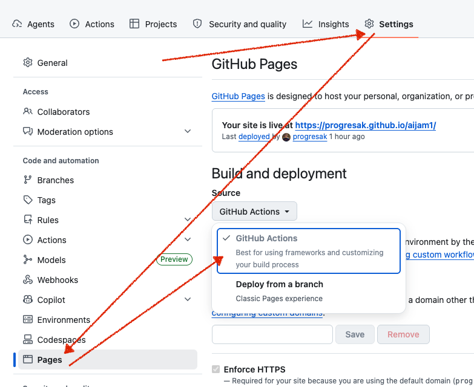

# GitHub Pages pro fork

Po forknutí tohoto repozitáře se GitHub Pages automaticky nespustí. Musíš udělat dva kroky.

## 1. Povolit GitHub Actions

GitHub z bezpečnostních důvodů ve forkách Actions vypíná.

1. Otevři svůj fork na GitHubu
2. Klikni na záložku **Actions**
3. Klikni na tlačítko **I understand my workflows, go ahead and enable them**

## 2. Zapnout GitHub Pages

1. Jdi do **Settings** → **Pages** (v levém menu sekce "Code and automation")
2. V sekci **Source** vyber **GitHub Actions**
3. Ulož



## 3. Spustit deploy

Máš dvě možnosti:

- **Pushni cokoliv do `main`** — workflow se spustí automaticky
- **Spusť ručně** — v záložce Actions vyber workflow "Deploy static content to Pages" a klikni **Run workflow**

Po úspěšném buildu najdeš svůj web na adrese:

```
https://<tvůj-github-username>.github.io/<název-repa>/
```
